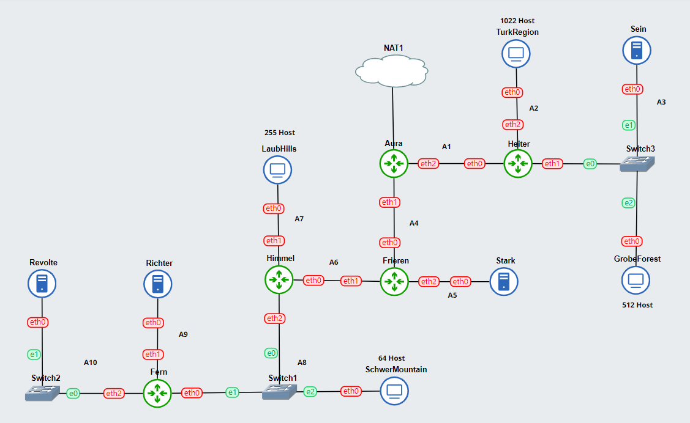
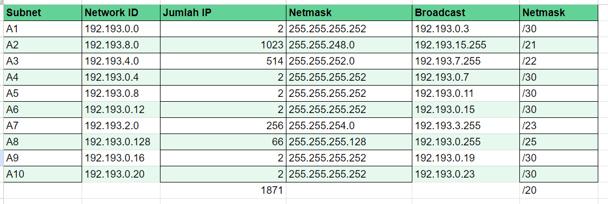

# Jarkom-Modul-5-D04-2023
# Anggota Kelompok
|                Nama                |    NRP     |
| :--------------------------------: | :--------: |
|       Muhammad Rafi Sutrisno       | 5025211167 |
|      Nadira Milha Nailul Fath      | 5025211253 |
## Soal
1. Agar topologi yang kalian buat dapat mengakses keluar, kalian diminta untuk mengkonfigurasi Aura menggunakan iptables, tetapi tidak ingin menggunakan MASQUERADE.
2. Kalian diminta untuk melakukan drop semua TCP dan UDP kecuali port 8080 pada TCP.
3. Kepala Suku North Area meminta kalian untuk membatasi DHCP dan DNS Server hanya dapat dilakukan ping oleh maksimal 3 device secara bersamaan, selebihnya akan di drop.
4. Lakukan pembatasan sehingga koneksi SSH pada Web Server hanya dapat dilakukan oleh masyarakat yang berada pada GrobeForest.
5. Selain itu, akses menuju WebServer hanya diperbolehkan saat jam kerja yaitu Senin-Jumat pada pukul 08.00-16.00.
6. Lalu, karena ternyata terdapat beberapa waktu di mana network administrator dari WebServer tidak bisa stand by, sehingga perlu ditambahkan rule bahwa akses pada hari Senin - Kamis pada jam 12.00 - 13.00 dilarang (istirahat maksi cuy) dan akses di hari Jumat pada jam 11.00 - 13.00 juga dilarang (maklum, Jumatan rek).
7. Karena terdapat 2 WebServer, kalian diminta agar setiap client yang mengakses Sein dengan Port 80 akan didistribusikan secara bergantian pada Sein dan Stark secara berurutan dan request dari client yang mengakses Stark dengan port 443 akan didistribusikan secara bergantian pada Sein dan Stark secara berurutan.
8. Karena berbeda koalisi politik, maka subnet dengan masyarakat yang berada pada Revolte dilarang keras mengakses WebServer hingga masa pencoblosan pemilu kepala suku 2024 berakhir. Masa pemilu (hingga pemungutan dan penghitungan suara selesai) kepala suku bersamaan dengan masa pemilu Presiden dan Wakil Presiden Indonesia 2024.
9. Sadar akan adanya potensial saling serang antar kubu politik, maka WebServer harus dapat secara otomatis memblokir  alamat IP yang melakukan scanning port dalam jumlah banyak (maksimal 20 scan port) di dalam selang waktu 10 menit. 
(clue: test dengan nmap)
10. Karena kepala suku ingin tau paket apa saja yang di-drop, maka di setiap node server dan router ditambahkan logging paket yang di-drop dengan standard syslog level. 

## TOPOLOGI
### GNS3

### Pembagian IP


### Subnetting & Routing
Aura
```
auto eth0
iface eth0 inet dhcp

auto eth1
iface eth1 inet static
	address 192.193.0.5
	netmask 255.255.255.252

auto eth2
iface eth2 inet static
	address 192.193.0.1
	netmask 255.255.255.252
up iptables -t nat -A POSTROUTING -o eth0 -j MASQUERADE -s 192.193.0.0/20
```
Heiter
```
auto eth0
iface eth0 inet static
	address 192.193.0.2
	netmask 255.255.255.252
	gateway 192.193.0.1
	up echo nameserver 192.168.122.1 > /etc/resolv.conf

auto eth1
iface eth1 inet static
	address 192.193.4.1
	netmask 255.255.252.0

auto eth2
iface eth2 inet static
	address 192.193.8.1
	netmask 255.255.248.0
```

TukrHostRegion
```
auto eth0
iface eth0 inet dhcp
hwaddress ether c2:b2:ca:6d:68:68
up echo nameserver 192.168.122.1 > /etc/resolv.conf
```

Sein
```
auto eth0
iface eth0 inet static
	address 192.193.4.2
	netmask 255.255.252.0
	gateway 192.193.4.1
	up echo nameserver 192.168.122.1 > /etc/resolv.conf
```

GrobeForest
```
auto eth0
iface eth0 inet dhcp
hwaddress ether 2e:87:72:ba:40:39
up echo nameserver 192.168.122.1 > /etc/resolv.conf
```

Frieren
```
auto eth0
iface eth0 inet static
	address 192.193.0.6
	netmask 255.255.255.252
	gateway 192.193.0.5
	up echo nameserver 192.162.122.1 > /etc/resolv.conf

auto eth1
iface eth1 inet static
	address 192.193.0.13
	netmask 255.255.255.252

auto eth2
iface eth2 inet static
	address 192.193.0.9
	netmask 255.255.255.252
```
Stark
```
auto eth0
iface eth0 inet static
	address 192.193.0.10
	netmask 255.255.255.252
	gateway 192.193.0.9
	up echo nameserver 192.168.122.1 > /etc/resolv.conf
```

Himmel
```
auto eth0
iface eth0 inet static
	address 192.193.0.14
	netmask 255.255.255.252
	gateway 192.193.0.13
	up echo nameserver 192.168.122.1 > /etc/resolv.conf

auto eth1
iface eth1 inet static
	address 192.193.2.1
	netmask 255.255.254.0

auto eth2
iface eth2 inet static
	address 192.193.0.129
	netmask 255.255.255.128
```

LaubHills
```
auto eth0
iface eth0 inet dhcp
hwaddress ether 2a:a2:ac:db:93:38
up echo nameserver 192.168.122.1 > /etc/resolv.conf
```
SchwerMountain
```
auto eth0
iface eth0 inet dhcp
hwaddress ether a6:7f:8c:62:99:3c
up echo nameserver 192.168.122.1 > /etc/resolv.conf
```

Fern
```
auto eth0
iface eth0 inet static
	address 192.193.0.130
	netmask 255.255.255.128
	gateway 192.193.0.129
	up echo nameserver 192.168.122.1 > /etc/resolv.conf

auto eth1
iface eth1 inet static
	address 192.193.0.17
	netmask 255.255.255.252

auto eth2
iface eth2 inet static
	address 192.193.0.21
	netmask 255.255.255.252
```

Richter
```
auto eth0
iface eth0 inet static
	address 192.193.0.18
	netmask 255.255.255.252
	gateway 192.193.0.17
	up echo nameserver 192.168.122.1 > /etc/resolv.conf
```

Revolte
```
auto eth0
iface eth0 inet static
	address 192.193.0.22
	netmask 255.255.255.252
	gateway 192.193.0.21
	up echo nameserver 192.168.122.1 > /etc/resolv.conf
```
### ROUTING

AURA
```
#Kiri
route add -net 192.193.8.0 netmask 255.255.248.0 gw 192.193.0.2 #A2
route add -net 192.193.4.0 netmask 255.255.252.0 gw 192.193.0.2 #A3

#Bawah
route add -net 192.193.0.8 netmask 255.255.255.252 gw 192.193.0.6 #A5
route add -net 192.193.0.12 netmask 255.255.255.252 gw 192.193.0.6 #A6
route add -net 192.193.2.0 netmask 255.255.254.0 gw 192.193.0.6 #A7
route add -net 192.193.0.128 netmask 255.255.255.128 gw 192.193.0.6 #A8
route add -net 192.193.0.16 netmask 255.255.255.252 gw 192.193.0.6 #A9
route add -net 192.193.0.20 netmask 255.255.255.252 gw 192.193.0.6 #A10
```
FRIEREN
```
route add -net 192.193.2.0 netmask 255.255.254.0 gw 192.193.0.14 #A7
route add -net 192.193.0.128 netmask 255.255.255.128 gw 192.193.0.14 #A8
route add -net 192.193.0.16 netmask 255.255.255.252 gw 192.193.0.14 #A9
route add -net 192.193.0.20 netmask 255.255.255.252 gw 192.193.0.14 #A10
```
HIMMEL
```
route add -net 192.193.0.16 netmask 255.255.255.252 gw 192.193.0.130 #A9
route add -net 192.193.0.20 netmask 255.255.255.252 gw 192.193.0.130 #A10
```

### DHCP

#### Script Revolte (DHCP SERVER)

```
apt-get update
apt-get install isc-dhcp-server -y

echo '
INTERFACESv4="eth0" #koneksi ke DHCP Relay
' > /etc/default/isc-dhcp-server

echo '
subnet 192.193.0.0 netmask 255.255.255.252 {
        option routers 192.193.0.1;
        option broadcast-address 192.193.0.3;
}

subnet 192.193.8.0 netmask 255.255.248.0 {
        option routers 192.193.8.1;
        option broadcast-address 192.193.15.255;
}

subnet 192.193.4.0 netmask 255.255.252.0 {
           option routers 192.193.4.1;
        option broadcast-address 192.193.7.255;
}

subnet 192.193.0.4 netmask 255.255.255.252 {
        option routers 192.193.0.5;
        option broadcast-address 192.193.0.7;
}

subnet 192.193.0.8 netmask 255.255.255.252 {
        option routers 192.193.0.9;
        option broadcast-address 192.193.0.11;
}

subnet 192.193.0.12 netmask 255.255.255.252 {
        option routers 192.193.0.13;
        option broadcast-address 192.193.0.15;
}

subnet 192.193.2.0 netmask 255.255.254.0 {
        option routers 192.193.2.1;
        option broadcast-address 192.193.3.255;
}

subnet 192.193.0.128 netmask 255.255.252.128 {
        option routers 192.193.0.129;
        option broadcast-address 192.193.0.255;
}

subnet 192.193.0.16 netmask 255.255.255.252 {
        option routers 192.193.0.17;
        option broadcast-address 192.193.0.19;
}

subnet 192.193.0.20 netmask 255.255.255.252 {
        option routers 192.193.0.21;
        option broadcast-address 192.193.0.23;
}

host schewrchmountain {
    hardware ethernet a6:7f:8c:62:99:3c;
    fixed-address 192.193.0.131;
}

host laubhils {
        hardware ethernet 2a:a2:ac:db:93:38;
        fixed-address 192.193.2.2;
}

host Turkregion {
        hardware ethernet c2:b2:ca:6d:68:68;
        fixed-address 192.193.8.2;
}

host grobeforest {
        hardware ethernet 2e:87:72:ba:40:39;
        fixed-address 192.193.4.3;
}

' > /etc/dhcp/dhcpd.conf

service isc-dhcp-server start
```

#### Script DHCP relay
```
apt-get update
apt-get install isc-dhcp-relay -y
service isc-dhcp-relay start

echo '
SERVERS="192.193.0.22"
INTERFACES="eth0 eth1 eth2"
OPTIONS=""
' > /etc/default/isc-dhcp-relay

echo '
net.ipv4.ip_forward=1
' > /etc/sysctl.conf

service isc-dhcp-relay restart

```
### Jawaban 

#### No 1
Pada Aura :

``` shell
ETH0_IP=$(ip -4 addr show eth0 | grep -oP '(?<=inet\s)\d+(\.\d+){3}')
iptables -t nat -A POSTROUTING -o eth0 -j SNAT --to-source $ETH0_IP
```
penggunaan awk untuk memfilter baris yang mengandung "inet" dan mencetak kolom kedua (alamat IP). Penggunaan cut digunakan untuk memisahkan alamat IP dan mask dari output awk. Hasil akhirnya tetap sama, yaitu mendapatkan alamat IP eth0 dan menerapkan SNAT pada iptables.
POSTROUTING Digunakan untuk mentranslasi address setelah proses routing. Dilakukan dengan merubah source IP Address dari paket data.
SNAT (Source NAT), yaitu ketika anda mengubah alamat asal dari paket pertama dengan kata lain anda mengubah dari mana koneksi terjadi.


#### No 2
Pada Sein & grabeforest :

``` shell
apt-get update
apt-get install netcat -y

# Menolak semua koneksi TCP kecuali port 8080
iptables -A INPUT -p tcp --dport 8080 -j ACCEPT
iptables -A INPUT -p tcp -j DROP

# Menolak semua koneksi UDP
iptables -A INPUT -p udp -j DROP
```
DROP – Firewall akan menolak paket data.<br>
ACCEPT – Firewall akan mengizinkan paket data.<br>
Setelah memperbarui paket dan menginstal Netcat, terapkan aturan iptables. Aturan pertama mengizinkan koneksi TCP ke port 8080, aturan kedua menolak koneksi TCP yang tidak sesuai, dan aturan ketiga menolak semua koneksi UDP. Dengan cara ini, firewall dibuat untuk membatasi jenis koneksi yang diizinkan masuk ke sistem.


#### No 3
Pada Revolte & Richter (DHCP server & DNS Server) :

```
# Allow established and related connections
iptables -A INPUT -m state --state ESTABLISHED,RELATED -j ACCEPT


# Limit ICMP connections to 3 per second
iptables -A INPUT -p icmp -m connlimit --connlimit-above 3 --connlimit-mask 0 -j DROP
```

Izinkan koneksi yang sudah ESTABLISHED (koneksi yang telah ditetapkan sebelumnya) dan koneksi RELATED (koneksi yang berkaitan dengan koneksi yang sudah ada).<br>

Script tersebut membatasi jumlah paket ICMP yang diterima menjadi 3 per detik. Jika jumlah koneksi ICMP melebihi batas ini, aturan ini akan menolak koneksi tambahan (DROP).


#### No 4
Pada Sein & Stark (Web Server) :
```shell
iptables -A INPUT -p tcp --dport 22 -s 192.193.4.3/22 -j ACCEPT
iptables -A INPUT -p tcp --dport 22 -j DROP
```
Script akan melakukkan ACCEPT koneksi TCP ke port 22 (SSH) dari alamat IP 192.193.4.3 (GrobeForest) atau dari rentang alamat IP dalam subnet 192.193.4.3/22. Lalu menolak semua koneksi TCP ke port 22 yang tidak sesuai dengan aturan sebelumnya.


#### No 5
Pada Sein & Stark (Web Server) :
```shell
# Izinkan akses ke Web Server pada senin-jumat pukul 08:00-16:00
iptables -A INPUT -p tcp --dport 80 -m time --timestart 08:00 --timestop 16:00 --weekdays Mon,Tue,Wed,Thu,Fri -j ACCEPT
```
Menggunakan modul waktu (time) untuk menentukan jangka waktu kapan aturan ini berlaku. Script ini mengizinkan koneksi hanya pada waktu mulai pukul 08:00 dan berakhir pukul 16:00. Selain itu, aturan ini berlaku hanya pada hari Senin hingga Jumat.


#### No 6
Pada Sein & Stark (Web Server) :
```
iptables -A INPUT -p tcp --dport 80 -m time --timestart 12:00 --timestop 13:00 --weekdays Mon,Tue,Wed,Thu -j DROP
iptables -A INPUT -p tcp --dport 80 -m time --timestart 11:00 --timestop 13:00 --weekdays Fri -j DROP
```
Pada script diatas ditetapkan waktu dimana koneksi akan dilarang pada hari senin hingga kamis pada pukul 12:00-13:00 dan pada saat hari jumat pada pukul 11:00-13.00
Testing pada grobeforest
```
nmap 192.193.4.2 22
```


#### No 7
Pada Heiter :

```
iptables -A PREROUTING -t nat -p tcp --dport 80 -d 192.193.4.2 -m statistic --mode nth --every 2 --packet 0 -j DNAT --to-destination 192.193.4.2

iptables -A PREROUTING -t nat -p tcp --dport 80 -d 192.193.4.2 -j DNAT --to-destination 192.193.0.10

iptables -A PREROUTING -t nat -p tcp --dport 443 -d 192.193.0.10 -m statistic --mode nth --every 2 --packet 0 -j DNAT --to-destination 192.193.0.10

iptables -A PREROUTING -t nat -p tcp --dport 443 -d 192.193.0.10 -j DNAT --to-destination 192.193.4.2
```
Mendistribusikan port 80 secara bergantian pada sein dan stark begitu juga dengan port 443.
Pada Sein dan Stark :
```
#sein
while true; do nc -l -p 80 -c 'echo "welcome to sein!"'; done
#stark
while true; do nc -l -p 80 -c 'echo "welcome to stark!"'; done
#sein
while true; do nc -l -p 443 -c 'echo "welcome to sein!"'; done
#stark
while true; do nc -l -p 443 -c 'echo "welcome to stark!"'; done
```
Testing pada turkregion
```
nc 192.193.0.10 443
nc 192.193.4.2 80
```


#### No 8
```
iptables -A INPUT -p tcp --dport 80 -s 192.193.0.20/30 -m time --datestart 2023-12-10 --datestop 2024-02-15 -j DROP
```
Menggunakan aturan pemilu pada tanggal 10 desember 2023 hingga tangga; 15 januari 2024
testing pada grobeforest dan revolte:
```
nmap 192.193.4.2 80
```


#### No 9
pada webserver
```
iptables -N scan_port

iptables -A INPUT -m recent --name scan_port --update --seconds 600 --hitcount 20 -j DROP

iptables -A FORWARD -m recent --name scan_port --update --seconds 600 --hitcount 20 -j DROP

iptables -A INPUT -m recent --name scan_port --set -j ACCEPT

iptables -A FORWARD -m recent --name scan_port --set -j ACCEPT
```
Melakukan setting maksimal 20 kali scan port dalam selang waktu 10 menit
testing pada laubhills
```
ping 192.192.0.10

```


#### No 10
pada semua node kecuali client
```
iptables -A INPUT  -j LOG --log-level debug --log-prefix 'Dropped Packet' -m limit --limit 1/second --limit-burst 10
```
testing pada sein
```
iptables -L
```

